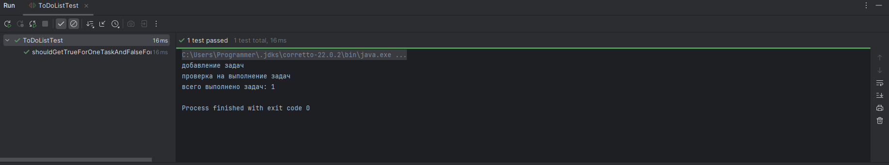

# Лабораторная работа №2_1: Тестовое окружение в JUnit

## 👨‍🎓 Студент
- **ФИО:** Катин Александр
- **Группа:** 245
- **Вариант:** 9 (Список дел (ToDoList))

---

## ✅ Выполненные задания

### Задание 1 (Простое)
**Тест:** Добавление задачи "Купить молоко" и проверка, что количество задач стало 1

### Задание 2 (Среднее)
**Тесты:** 
- Добавление задачи "Купить хлеб", "Сделать уроки"
- Отметка существующей задачи как выполненной (индекс 0 — статус становится true).
- Отметка несуществующей задачи (индекс 5 — возвращается false, статусы не меняются).

### Задание 3 (Сложное)
**Тест:**  статический счетчик totalTasksCompleted. Инициализация счетчик = 0. Каждый успешный вызов markCompleted увеличиват счетчик на 1. Поверяем увеличение счетчика. Вывод общее количество выполненных задач.

---

## 📊 Результаты
![Все тесты пройдены]

---

## 📎 Ссылки
- [Код теста BankAccount](src/test/BankAccountTest.java)
- [Код теста ToDoList](src/main/java/ToDoListTest.java)

*Дата: 11.03.2026*

